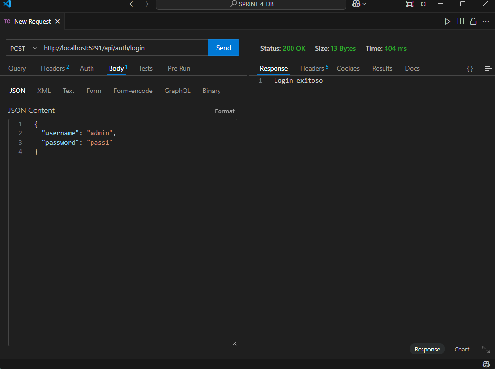
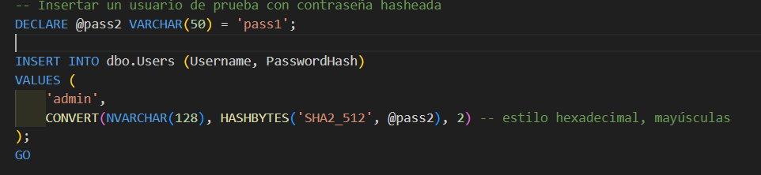
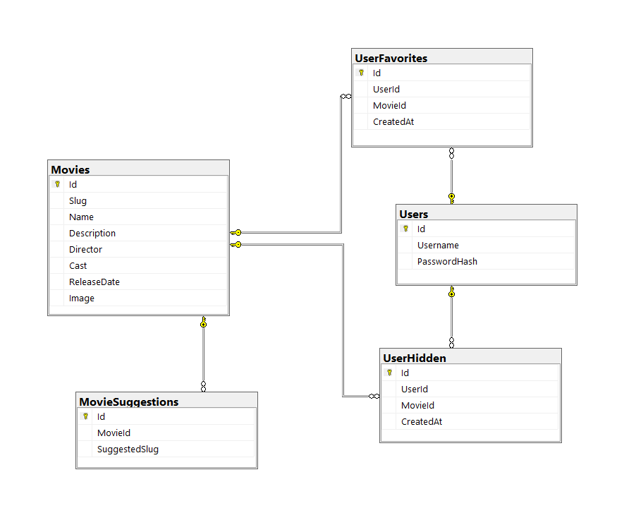
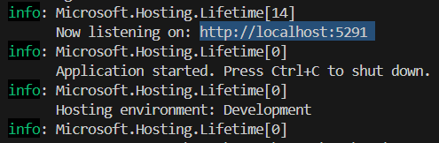

# Sprint 4 Base de datos integracion

## Descripción del Proyecto

En este sprint se integró una base de datos SQL Server con una API desarrollada en C# utilizando el patrón **Modelo - Vista - Controlador (MVC)** junto con **Entity Framework Core**. El propósito fue conectar el frontend desarrollado previamente en **Angular** con un backend  que permita manejar autenticación de usuarios y consumo de datos desde una fuente persistente, asi como crear la tablas de las peliculas que se manejan en el catalog-movies.

---

## Estructura del Proyecto

El proyecto se encuentra dividido en tres carpetas principales:

### `ApiPeliculas`
Contiene el backend construido en **ASP.NET Core** con la siguiente organización:

- **Controllers/**
  - `AuthController.cs`: Controlador responsable de gestionar el login del usuario.
- **Data/**
  - `ApplicationDbContext.cs`: Clase que representa el contexto de la base de datos usando Entity Framework.
- **Models/**
  - `User.cs`: Modelo que representa a los usuarios en la base de datos.
  - `UseLogin.cs`: Modelo utilizado para la autenticación de login.
- **Services/**
  - `AuthService.cs`: Servicio que encapsula la lógica de autenticación y hashing de contraseñas.
- `Program.cs`: Archivo principal de configuración del servidor.
- `appsettings.json`: Configuración de la conexión con SQL Server.





### `frontend`
Contiene el frontend desarrollado con **Angular**:

- **src/app/login/**: Componente de inicio de sesión.
- **src/app/movies-catalog/**: Componente que muestra el catálogo de películas.
- **assets/**, **public/**, **node_modules/**: Carpetas estándar del entorno Angular.

---

### `SQL_server`
Contiene los scripts SQL necesarios para levantar la base de datos en SQL Server:

- **`Database_User.sql`**:  
  Crea la base de datos `LoginApp` y la tabla `Users`:
  ```sql
  CREATE TABLE Users (
      Id INT PRIMARY KEY IDENTITY(1,1),
      Username NVARCHAR(100) NOT NULL UNIQUE,
      PasswordHash NVARCHAR(128) NOT NULL,
  );
  ```



- **` Insercion de Tablas.sql`**:  
  Script para definir otras tablas como `Movies`, `Categories`, etc.  
  Ejemplo de estructura:
  ```sql
  CREATE TABLE Movies (
      Id INT PRIMARY KEY IDENTITY(1,1),
      Title NVARCHAR(200),
      Description NVARCHAR(MAX),
      Director NVARCHAR(100),
      ReleaseDate DATE
  );
  ```


## Tecnologías Utilizadas

### Backend:
- ASP.NET Core Web API
- Entity Framework Core
- SQL Server

### Frontend:
- Angular 18
- TypeScript
- HTML/CSS

---

## Funcionalidades Implementadas

- **Login seguro con hash SHA-512**
- **Conexión entre Angular y API mediante HTTPClient**

---

## Instrucciones para ejecutar

### 1. Base de datos
- Asegúrate de tener SQL Server corriendo.
- Ejecuta los scripts de la carpeta `SQL_server` en este orden:
  1. `Database_User.sql`
  2. `Tablas.sql`
  3. `Insercion_peliculas.sql`

### 2. Backend
```bash
cd backend_API_C#
dotnet restore
dotnet run
```


### 3. Frontend
```bash
cd frontend
npm install
ng serve
```

---

## Lo que salió bien

- La autenticación con hash SHA-512 funcionó correctamente y protegió las credenciales.
- La base de datos SQL Server se estructuró de manera clara y funcional.

##  Lo que salió mal

- Hubo errores iniciales con la codificación del hash entre SQL Server y C#.
- Se encontraron conflictos con nombres duplicados de clases (por ejemplo, `User` vs `UserLogin`).

## Lo que se puede mejorar

- Mejor organización del código en capas (por ejemplo, separar DTOs y modelos de base de datos).
- Validaciones más robustas tanto en frontend como backend.
- Implementar control de sesiones o tokens (JWT) para futuras mejoras de seguridad.

---
