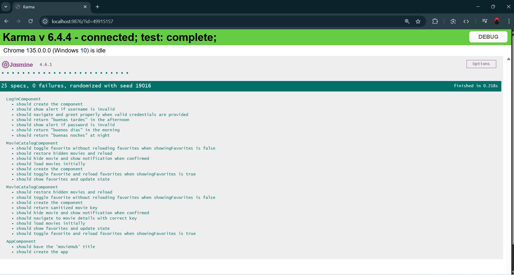
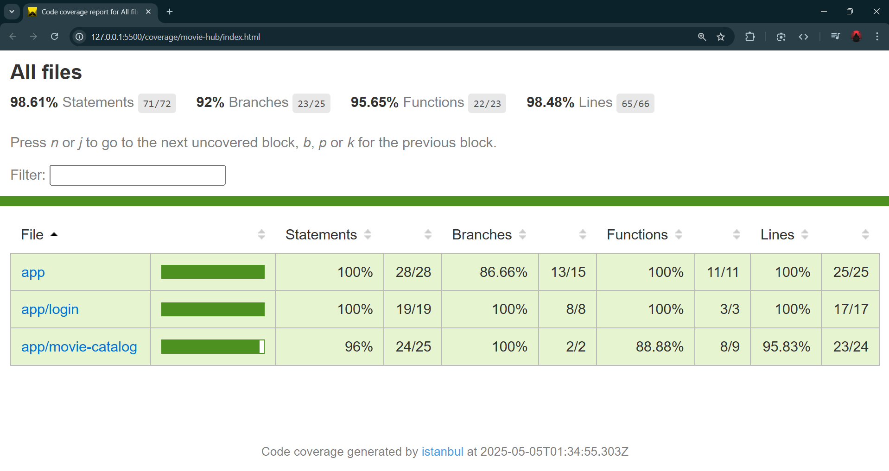
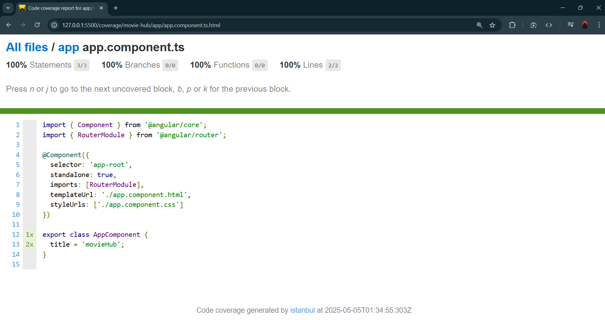
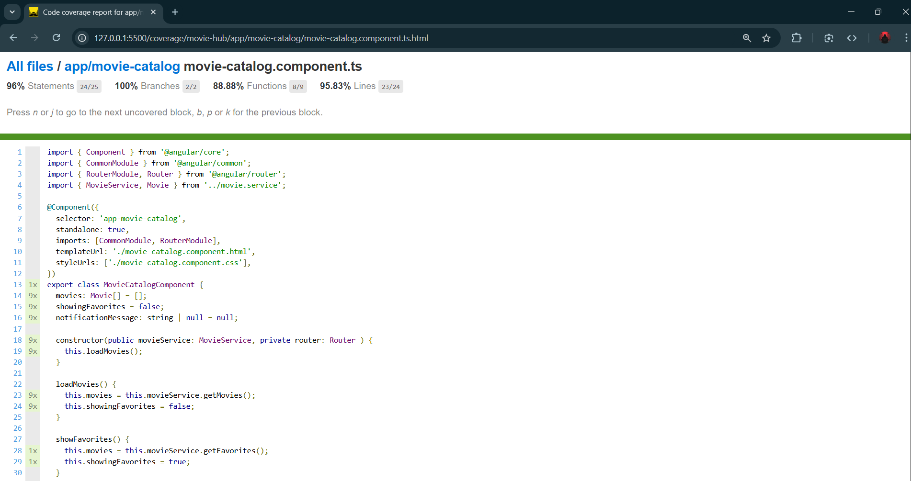
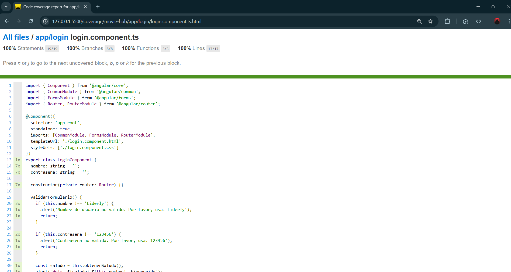
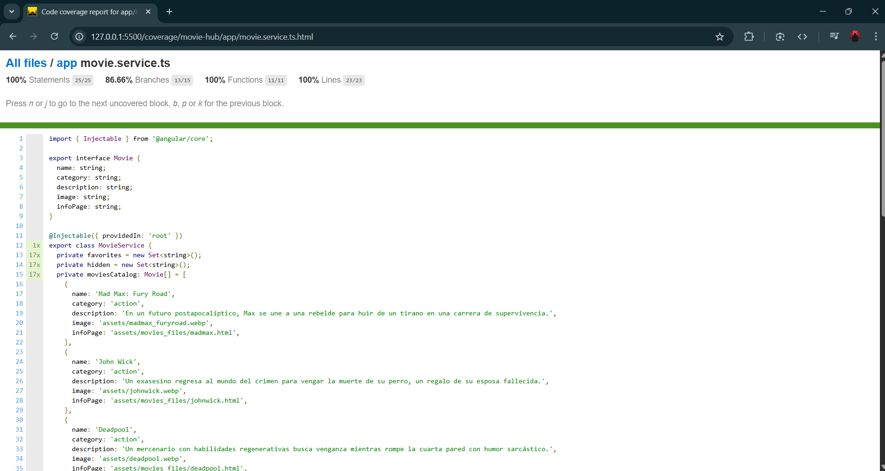

# MovieHub

This project was generated with [Angular CLI](https://github.com/angular/angular-cli) version 18.2.18.

## Added testing functions

En esta rama (`angular-testing`) se creó con el propósito de implementar y documentar **pruebas de testing** para la aplicación Angular previamente migrada en el sprint 2.

---

## Objetivo de la rama `angular-testing`

El commit principal de esta rama introduce pruebas para:

- Componentes principales de la aplicación
- Servicios (especialmente lógica)

Estas pruebas aseguran que el comportamiento esperado del sistema se mantenga a lo largo del desarrollo y facilitan futuras refactorizaciones.

---

## Tecnologías de testing usadas

- **Karma** + **Jasmine** (testing por defecto en Angular CLI)
- **TestBed** para configuración de entornos de prueba
---

## La cobertura de pruebas puede visualizarse en la terminal usando:

ng test --code-coverage

## Para las pruebas de test

ng test
