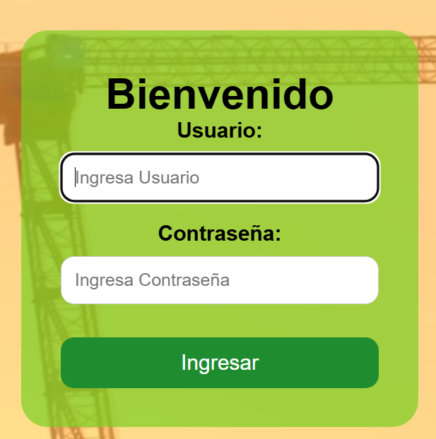
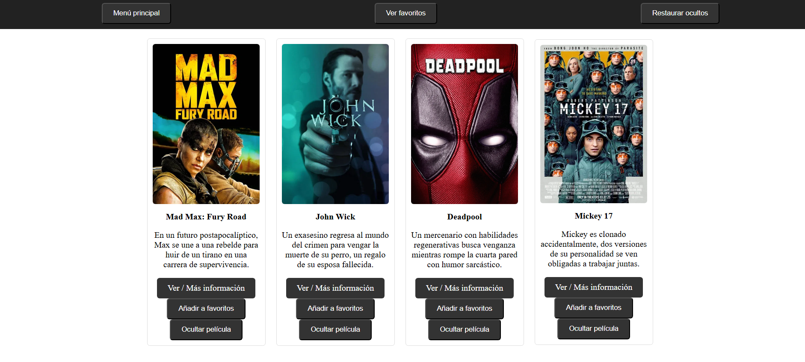
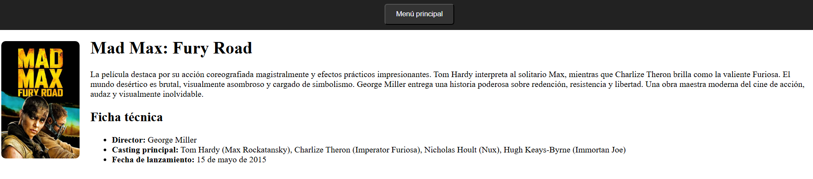
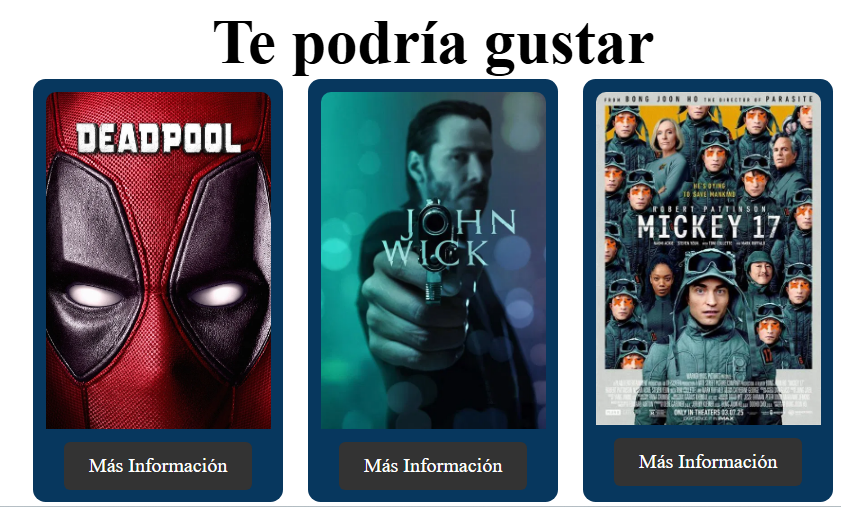
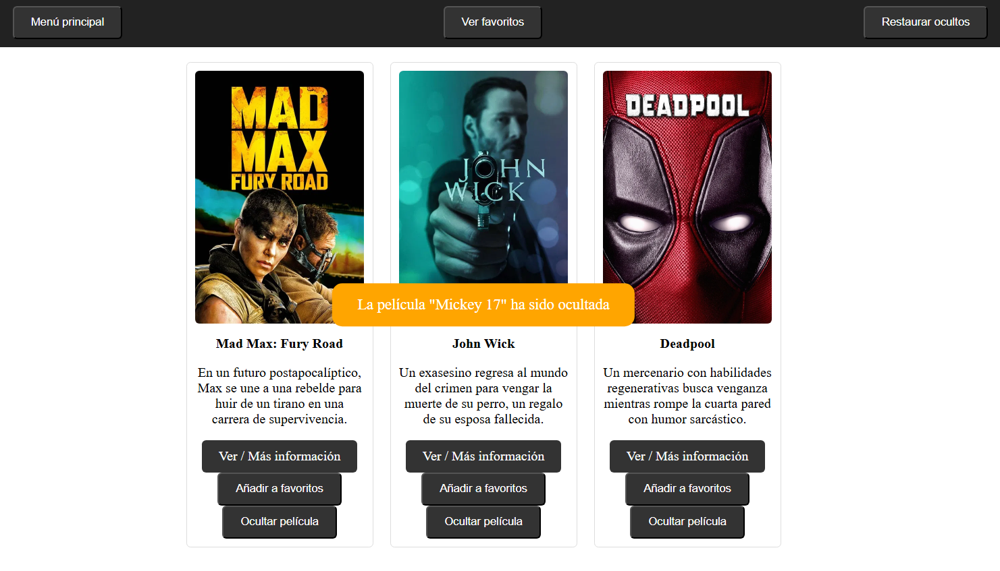

# 1. Resumen de máximo 3 líneas de tu proyecto

MovieHub es una página web de simulación de películas streaming, con una pantalla de inicio de sesión y un catálogo de películas. El objetivo es mostrar películas e información relacionada a cada película, además de tener funcionalidades de ofrecer sugerencias de películas similares, guardar películas en favoritos y permitir al usuario ocultar las que no le gustan mostrando un mensaje de confirmación antes de ocultar la película.

# 2. Requerimientos técnicos - Todo lo que usaste

- Lenguajes y tecnologías utilizadas:
  - HTML
  - CSS
  - JavaScript

- Recursos multimedia:
  - Video (`video.mp4`)
  - Imágenes en formato `.webp`

# 3. ¿Cómo instalar?

# Método 1: Visualización en línea
Accede al proyecto mediante el siguiente enlace:

# 💻 Método 2: De manera local
1. Descarga o clona el repositorio desde:  
   `https://www.github.com/repo`
2. Abre el archivo `index.html` con tu navegador (Chrome, Edge, etc.)
3. Iniciarás en la pantalla de login.

# 4. Mockup de la aplicación

# 5. Capturas de pantalla

1. **Pantalla de Login**  
   Simulación de inicio de sesión con usuario `Liderly` y contraseña `123456`.

2. **Catálogo de Películas**  
   Visualización general con posters, descripciones y botones de interacción.

3. **Detalle de Película**  
   Cada película cuenta con una página individual con información extendida.

4. **Películas Sugeridas**  
   Se muestran recomendaciones similares a la película seleccionada.

5. **Películas Ocultas**  
   Las películas que no gustan se pueden ocultar dinámicamente del catálogo.

# 6. Proceso de desarrollo

###  Fase 1: Login
- Se creó un formulario de login (sin autenticación real por ahora).
- Archivos: `index.html`, `styles.css`, `script.js`

###  Fase 2: Catálogo de Películas
- Se creó la carpeta `catalog` con los archivos index.html, styles.css, script.js, movies.js
- Cada película tiene su propio archivo HTML detallado
- Carpeta `img/` para almacenar las imágenes de posters.
- Mediante javascript se crean las tarjetas de películas tomando la información de movies.js
- Se definen los estilos de cada página

###  Fase 3: Creación de Lógica
- Se implementa la funcionalidad de los botones: Ver/Más información, Añadir a favoritos, Ocultar películas 
- Se crean la funciones de cada botón, se realizan pruebas de que funcionen correctamente a lo esperado y se implementan cambios 

## 7. Sprint Review
¿Qué salió bien?
Estructura inicial del login y catálogo
Simulación de recomendaciones
Añadir a favoritos
Ocultar película

¿Qué puedo hacer diferente?
Mejorar el diseño que se más responsivo
Que tenga más funcionalidades como filtros por categoría por ejemplo
Planeación y dividir las funcionalidades en partes pequeñas o módulos 

¿Qué no salió bien?  
La función de ocultar películas se puede mejorar
El login no está conectado a una base de datos
Hay pocas opciones de catalogo de peliculas
