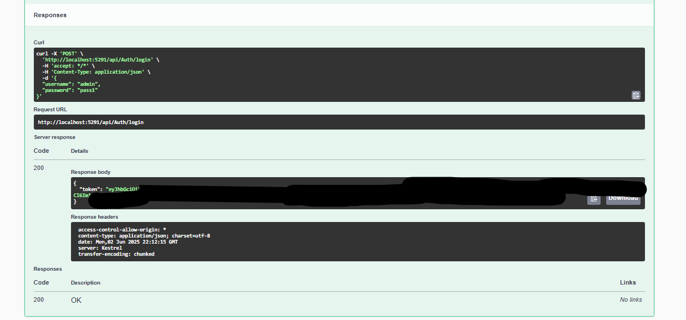
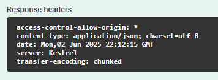
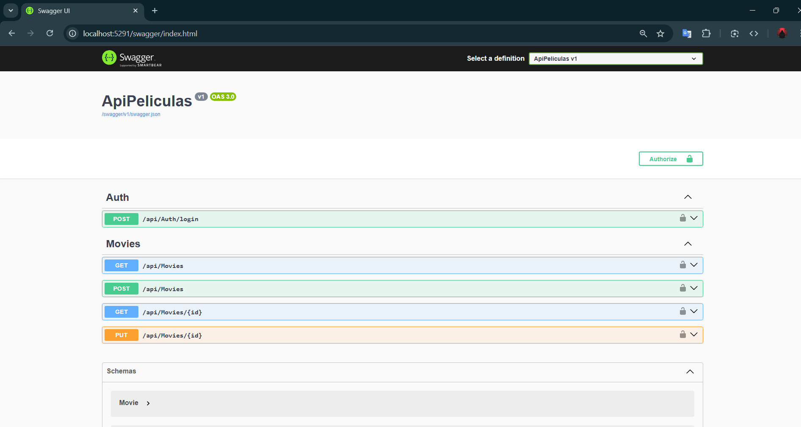
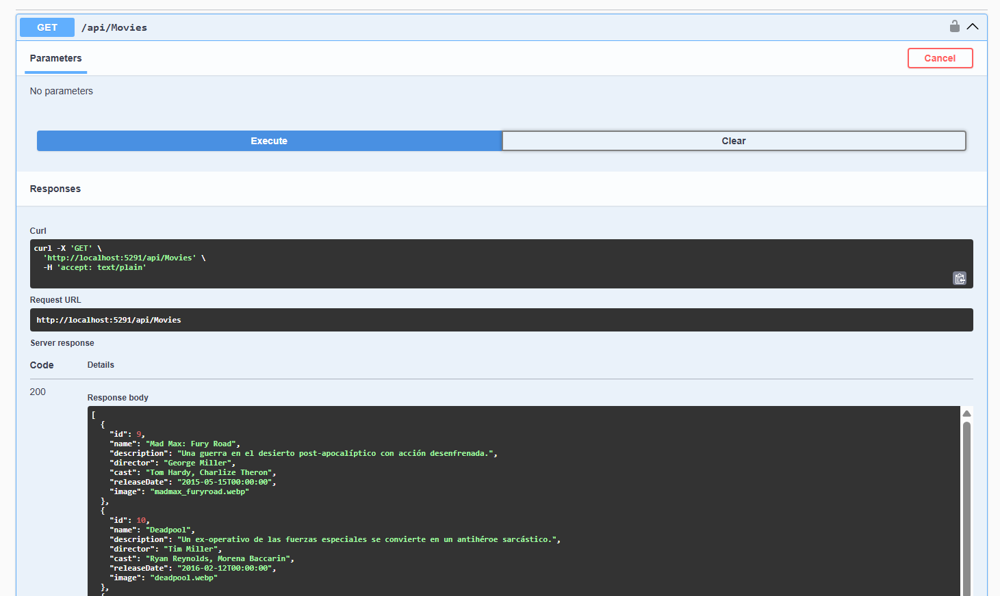
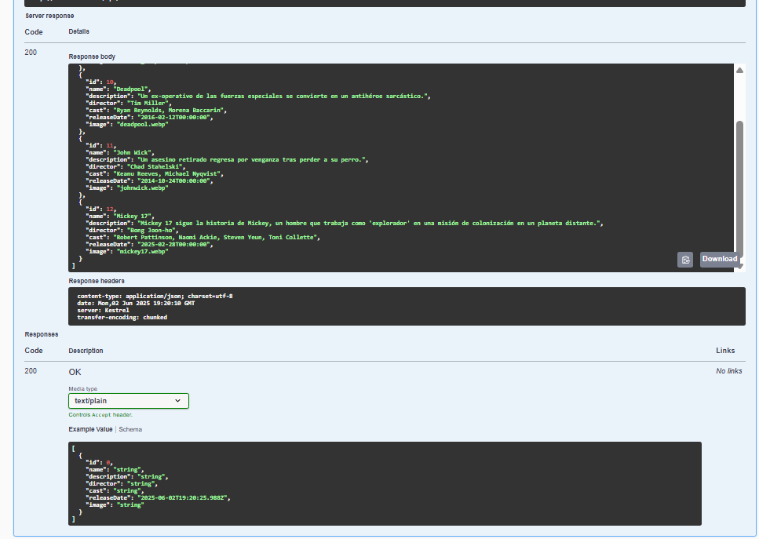
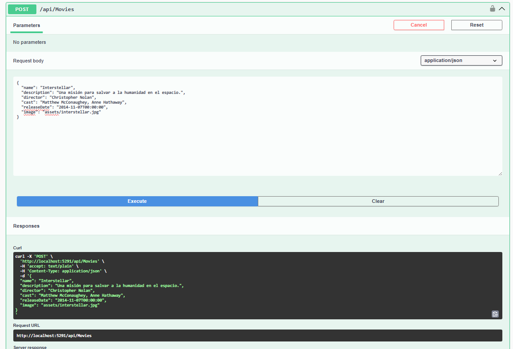
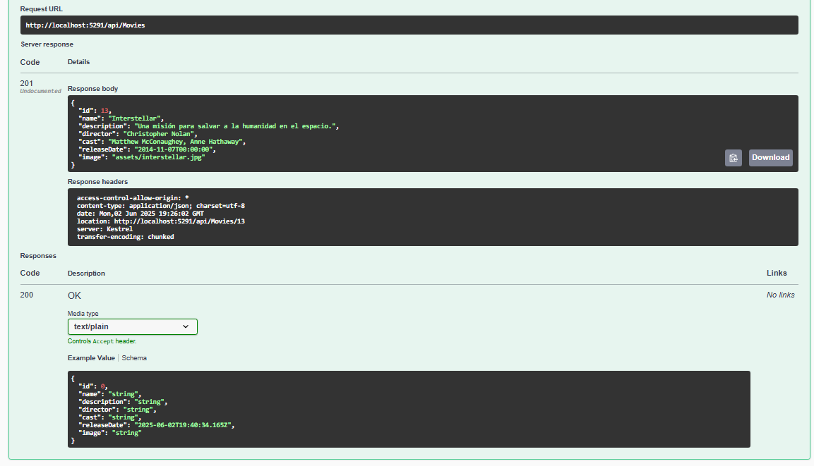
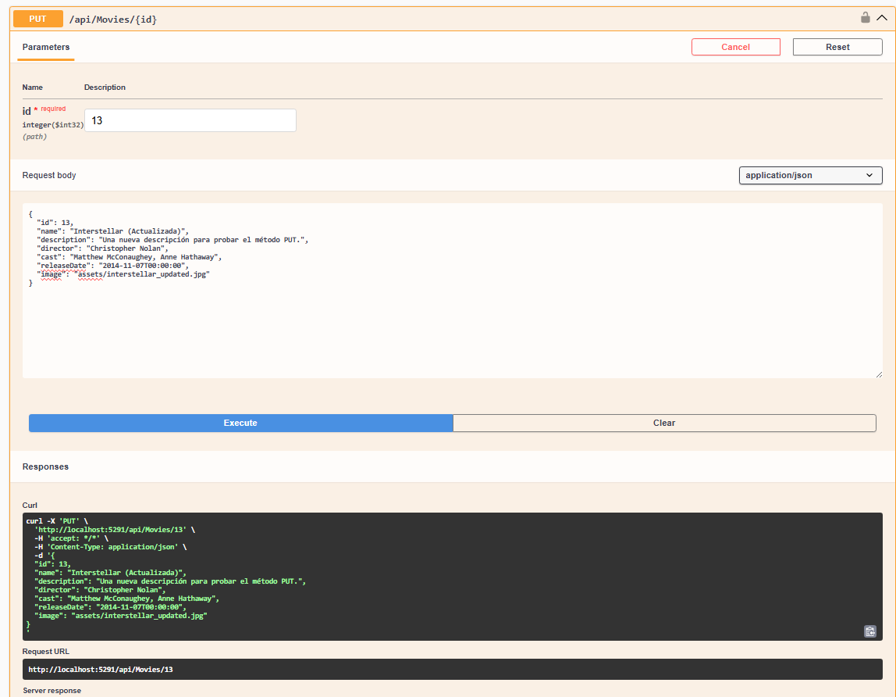
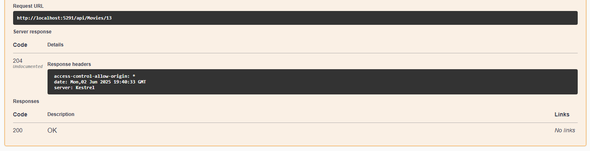

# Sprint 5

## MovieHub - Full Stack App (Angular 18 + [ASP.NET](http://asp.net/) Core + SQL Server)

Este repositorio contiene la versión full stack del proyecto **MovieHub**, una aplicación de catálogo de películas construida con **Angular 18** en el frontend, [**ASP.NET](http://asp.net/) Core Web API** como backend y **SQL Server** como base de datos.

---

## Cambios recientes implementados en SPRINT 5

### 1. Autenticación

- Validación de usuario y contraseña desde Angular 18, usando:
{
"username": "admin",
"password": "pass1"
}
- Contraseñas almacenadas de forma segura con hashing SHA-512.
- Generación y retorno de token usando JWT para proteger rutas privadas.

#### 1.1 Captura de pantalla autentificacion en Swagger con Token



### 2. Configuración de CORS

- Se habilitó **CORS** en el backend para permitir solicitudes desde Angular (`http://localhost:4200`).
- Esto resolvió errores de tipo `CORS policy blocked`.



### 3. Documentación con Swagger

- Se integró **Swagger** para documentar todos los endpoints del backend.



- Accesible en `http://localhost:5291/swagger` (al ejecutar la API).

- Se agrega Metodo GET para obtener peliculas mediante la API en el catalogo

#### Capturas de pantalla de GET en Swagger:





- Se agrega Metodo POST para agregar nuevas peliculas

#### Capturas de pantalla de POST en Swagger:





- Se agrega Metodo PUT para actualizar o modificar informacion del catalogo de peliculas

#### Capturas de pantalla de PUT en Swagger:




---

## Cómo instalar el proyecto localmente

### 1. Clona el repositorio

```bash
git clone <https://github.com/tu_usuario/movieshub.git>
cd movieshub

```

###  2. Base de datos (SQL Server)

- Asegúrarse de tener SQL Server y SSMS instalados.
- Ejecuta el script `MovieHubDB.sql` para crear la base de datos y tabla `Users`.
- Asegúrarse de agregar al menos un usuario con contraseña hasheada (SHA-512).

###  3. Backend - [ASP.NET](http://asp.net/) Core

```bash
cd ApiPeliculas
dotnet restore
dotnet run

```

- Swagger estará disponible en: http://localhost:5291/swagger
- Verifica que no falten paquetes (como `Microsoft.AspNetCore.Authentication.JwtBearer`)

###  4. Frontend - Angular 18

```bash
cd ../login-frontend
npm install
ng serve

```

- El frontend se ejecutará en: [http://localhost:4200](http://localhost:4200/)

---

##  Reflexión del desarrollo

###  ¿Qué hice bien?

- Implementar una arquitectura cliente-servidor funcional.
- Aplicar hashing de contraseñas y autenticación con JWT correctamente.
- Habilitar CORS para conexión entre dominios.
- Documentar la API con Swagge.

###  ¿Qué no salió bien al principio?

- La comunicacion entre frontend y backend no se lograba por lo cual se oimplemento cors.
- La propiedad `movieService` estaba sin inicializar, lo que causaba errores en Angular.
- Problemas con el token JWT por clave nula (no se había configurado correctamente en `appsettings.json`).

###  ¿Qué puedo hacer diferente?

- Agregar roles y autorizaciones en el token JWT.
- Implementar logout y expiración de sesión.
